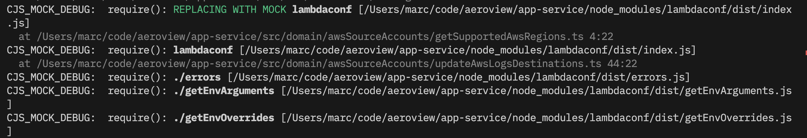

<picture>
    <source srcset="docs/graphic.svg" media="(prefers-color-scheme: dark)">
    <source srcset="docs/graphic-dark.svg" media="(prefers-color-scheme: light)">
    
</picture>

# cjs-mock

[](https://github.com/mhweiner/cjs-mock/actions)
[]()
[](https://opensource.org/licenses/MIT)
[](https://github.com/mhweiner/autorel)

NodeJS module mocking for CJS (CommonJS) modules for unit testing purposes. Similar to [proxyquire](https://www.npmjs.com/package/proxyquire), but simpler and safer. Sponsored by [Aeroview](https://aeroview.io).

**😃 Easy to use**
- Super simple & straightforward documentation
- Powerful debugging utility
- Built in Typescript support
- Supports partial mocking of nested dependencies

**🛡 Defensive & immutable mocking**
- Throws an error if any mocks are unused by module we are mocking
- Module Cache for mocked modules are always deleted before and after, to minimize side effects and make behavior more predictable and approximate immutability

**💪 Robust & reliable**
- Tiny codebase written in Typescript with only 1 tiny dependency

## Example

_isValidWord.ts_
```typescript
import {readFile} from 'fs/promises'; // we're going to mock this

export async function isValidWord(word: string) {
  const validWords = await getValidWords();
  return validWords.indexOf(word) !== -1;
}

async function getValidWords() {
  const contents = await readFile('./dict.txt', 'utf-8');
  return contents.split('\n');
}
```
_isValidWord.spec.ts_
```typescript
import {test} from 'hoare';
import {mock} from 'cjs-mock';
import * as mod from './isValidWord'; // just used for type

const dict = ['dog', 'cat', 'fish'].join('\n');
const mockMod: typeof mod = mock('./isValidWord', {
    'fs/promises': {readFile: () => Promise.resolve(dict)},
});

test('valid word returns true', async (assert) => {
  const result = await mockMod.isValidWord('dog');
  assert.equal(result, true);
});
```

See more examples in [docs/examples.md](docs/examples.md)

## Installation

 ```console
 npm i cjs-mock -D
 ```

## API

### `mock(modulePath: string, mocks: any): module`

Returns a module with Dependency Injection for `modulePath`, as specified by the `mocks` argument. As a side effect, the module cache is deleted for module specified by `modulePath` and all modules specified in `mocks`. This cache is deleted at the start and end of the function. This should not matter during unit testing, but would likely be a problem in a production environment.

You should pass as a string the same thing you would pass to an `import` statement or `require`, with the following caveats:

1. Any relative paths be relative to the module being returned
2. It must only be a _direct_ dependency of that module. It will not work recursively, including for re-exported modules (ie, `export * from 'foo'`).

This function throws if any of the modules or properties are not resolvable, or if there are any unused (not required/imported by the module specified in `modulePath`):
```
Error: Unable to find foo
```
```
Error: The following imports were unused in ./foo: 
        ./bar
```

This is a defensive measure to ensure that the mocks are being used as intended.

The mocked dependencies will only be resolved *once*, and the real (non-mocked) dependencies will be used for any subsequent imports/requires. This is to prevent the mocks from being used in other modules that import the same module.

However, this can also be a source of confusion.

To aid in debugging, you can set the environment variable `CJS_MOCK_DEBUG=1` to see the order of module resolution and mocking.

### `stub(name?: string): Stub`

Creates a function stub for use in unit tests, with optional expected argument checking and return value configuration. Could be a good replacement for `sinon.stub()`.

The returned stub function can be called like a normal function and includes additional methods:

- `getCalls(): any[]` — Returns an array of all calls made to the stub (each call is an array of arguments).
- `clear(): Stub` — Clears recorded calls and resets internal expectations.
- `setExpectedArgs(...args: any[]): Stub` — Defines the exact arguments the stub expects to receive. If the stub is called with different arguments, it throws an error.
- `setReturnValue(value: any): Stub` — Sets the value that the stub should return when called.
- `throws(error: Error): Stub` — Configures the stub to throw the specified error when called.

#### Stub Type Definition

```ts
export type Stub = ((...args: any[]) => any) & {
  getCalls: () => any[];
  clear: () => Stub;
  setExpectedArgs: (...expected: any[]) => Stub;
  setReturnValue: (value: any) => Stub;
  throws: (error: Error) => Stub;
};
```

#### Example

```ts
const myStub = stub()
  .setExpectedArgs('hello', 123)
  .setReturnValue('world');

console.log(myStub('hello', 123)); // 'world'
console.log(myStub.getCalls());    // [['hello', 123]]

myStub('oops'); // Throws: Stub called with unexpected arguments.
                // Expected: ['hello', 123]
                // Received: ['oops']
```

#### Named stub

You can give your stub name for easier debugging and error messages:

```ts
const myStub = stub("my-stub")
  .setExpectedArgs('hello', 123)
  .setReturnValue('world');

console.log(myStub('hello', 123)); // 'world'
console.log(myStub.getCalls());    // [['hello', 123]]

myStub('oops'); // Throws: Stub "my-stub" called with unexpected arguments.
                // Expected: ['hello', 123]
                // Received: ['oops']
```

## Partial mocking

You can nest `mock()` for partial mocking of nested dependencies:

```typescript
const m = mock('./foo', {
    '.': mock('./bar', {
        'bob': () => 'fake bob'
    })
});
```

## DO NOT USE IN PRODUCTION

Just like for `proxyquire` and other mocking utilities, use of this utility is not recommended in production environments, for the following reasons:

1. Mocking utilities (including this one) are typically designed for unit testing in a sandbox environment, not production code.
2. It's easy to get the mock wrong (which is why we throw errors for unused mocks and offer debug utilities).
3. It has side effects on the module cache, by clearing it. This can lead to some very unexpected behavior outside of a unit test.

## Debugging

A debugging utility is included, for use when you are having a difficult time seeing the order of how things are getting imported, and if a mock has been substituted after a successful resolution & match.

To enable this mode, set this in your environment: `CJS_MOCK_DEBUG=1`.

Example output (truncated screenshot):



In this screenshot, we can see that 'lambdaconf' is being imported twice, once from `./getSupportedAwsRegions.ts` (in which case they are getting the replacement mock), and `./updateAwsLogsDestinations.ts` (in which case they are not getting the replacement mock). This is because the module cache is cleared after the first import, and the real module is used for the second import. So, we either forgot to mock `lambdaconf` in one of these modules, or one of our imports also imports `lambdaconf` and we need to mock that module as well.

This can be useful for debugging, to see if a mock is being used or not, and to see the order of module resolution.

Be warned, this may produce a *metric ton* of output. It's sometimes shocking just how many modules are required in a node project, including built-in modules. You may want to limit the output to just the relevant test by only running that test.

# Support, feedback, and contributions

- Star this repo if you like it!
- Submit an [issue](https://github.com/mhweiner/autorel/issues) with your problem, feature request or bug report
- Issue a PR against `main` and request review. Make sure all tests pass and coverage is good.
- Write about this project in your blog, tweet about it, or share it with your friends!

# Sponsorship
<br>
<picture>
    <source srcset="docs/aeroview-white.svg" media="(prefers-color-scheme: dark)">
    <source srcset="docs/aeroview-black.svg" media="(prefers-color-scheme: light)">
    
</picture>
<br>

Aeroview is a lightning-fast, developer-friendly, and AI-powered logging IDE. Get started for free at [https://aeroview.io](https://aeroview.io).

Want to sponsor this project? [Reach out](mailto:mhweiner234@gmail.com?subject=I%20want%20to%20sponsor%20cjs-mock).

# Other useful libraries

- [autorel](https://github.com/mhweiner/autorel): Automate semantic releases based on conventional commits. Similar to semantic-release but much simpler.
- [hoare](https://github.com/mhweiner/hoare): An easy-to-use, fast, and defensive JS/TS test runner designed to help you to write simple, readable, and maintainable tests.
- [jsout](https://github.com/mhweiner/jsout): A Syslog-compatible, small, and simple logger for Typescript/Javascript projects.
- [brek](https://github.com/mhweiner/brek): A small, yet powerful typed and structured config library with lambda support for things like AWS Secrets Manager.
- [typura](https://github.com/aeroview/typura): Simple and extensible runtime input validation for TS/JS, written in TS, fried in batter.


# License

[MIT](LICENSE)
